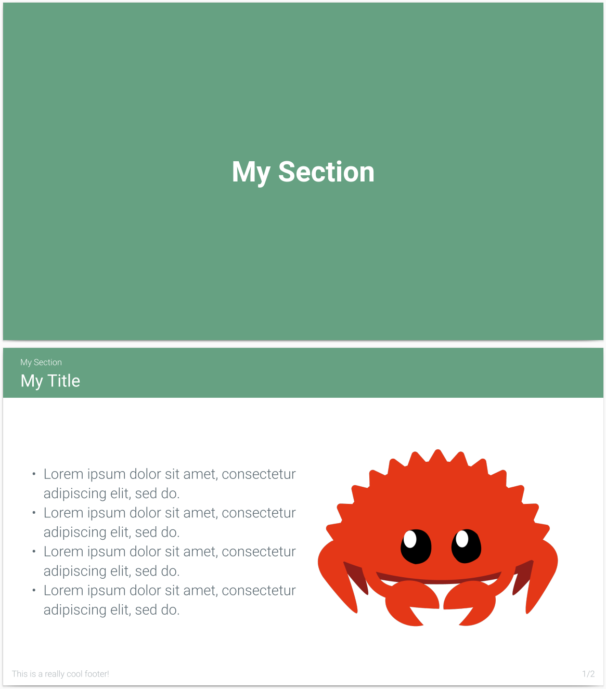
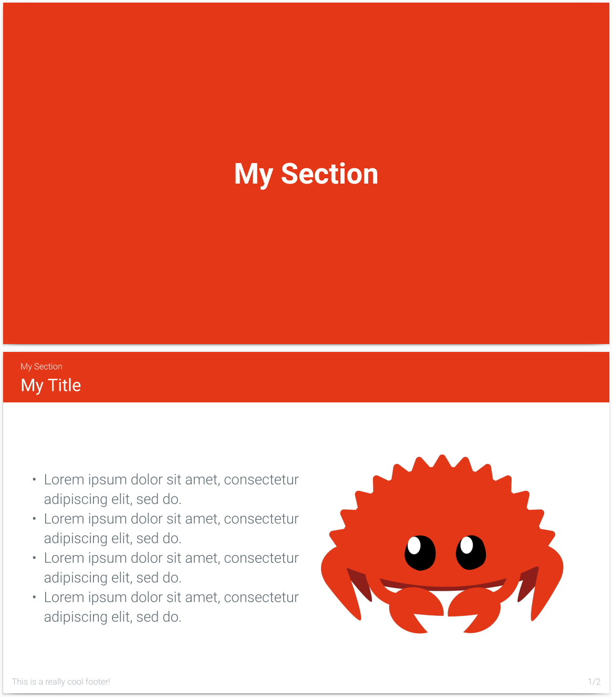
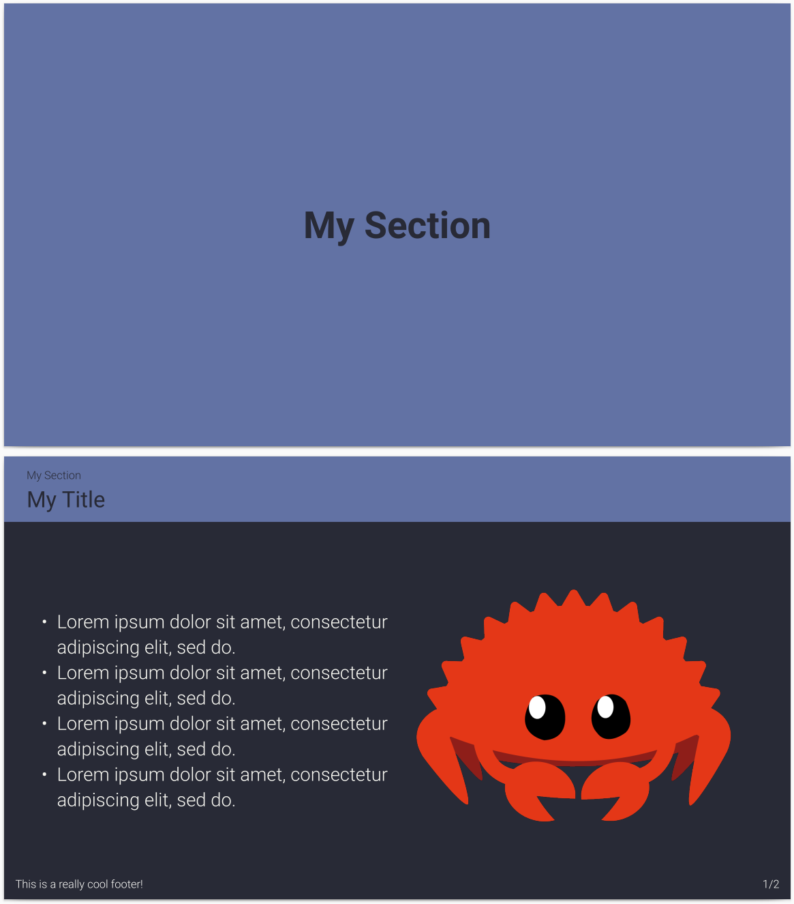
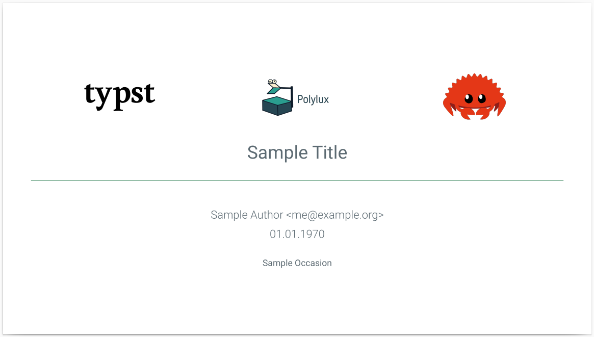

# Clean Polylux Template

This is a clean and dynamic presentation template for [Polylux](https://github.com/andreasKroepelin/polylux), a package for [Typst](https://typst.app/) to create nice looking presentations.

Initial work was already done, but I added lots of neat features, so now this template features:
- An easy to use templating interface, which just requires some meta information
- A footer with arbitrary text and a slide counter
- A slide counter, that does not suck! (as it only counts real slides and shows a total amount)
- Dynamic logos on the title slide
- Dynamic coloring via variables
- Automatic creation of a contents slide
- Dynamic header on each slide showing the slide's name and current section
- Focus slides

## Screenshots
| Light Theme with Green Accent | Light Theme with Orange Accent | Dark Theme with Purple Accent |
|:--:|:--:|:--:|
||||




## How to use
See [presentation.typ](./presentation.typ) for a sample presentation.
Make sure you have `typst` installed, otherwise you could use the provided Nix Flake with `nix develop .`

To just compile the presentation, run:
```sh
$ typst compile presentation.typ --open
```

To have a live preview, run:
```sh
$ typst watch presentation.typ --open
```

## Configure
The entire templating part is done in [theme.typ](./theme.typ).
Every major variable can be found towards the top of the file, marked with `CONFIG:` comments.
Here you can configure the font and the color of the slides, the rest will be adjusted automatically.


## Contribution
Feel free to fork this repository and make adjustments as you wish, but I would appreciate a small notice somewhere.
If you find visual bugs or have feature ideas, feel free to upstream them to this repository.

## Inspirations
- [matze/mtheme](https://github.com/matze/mtheme)
- [Enive](https://github.com/Enivex)
- [hargoniX](https://github.com/hargoniX/)
